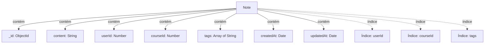

```mermaid
graph TD
    Note[Note] --> |contém| id[_id: ObjectId]
    Note --> |contém| content[content: String]
    Note --> |contém| userId[userId: Number]
    Note --> |contém| courseId[courseId: Number]
    Note --> |contém| tags[tags: Array of String]
    Note --> |contém| createdAt[createdAt: Date]
    Note --> |contém| updatedAt[updatedAt: Date]
    
    Note -.-> |índice| idx1[Índice: userId]
    Note -.-> |índice| idx2[Índice: courseId]
    Note -.-> |índice| idx3[Índice: tags]
```
