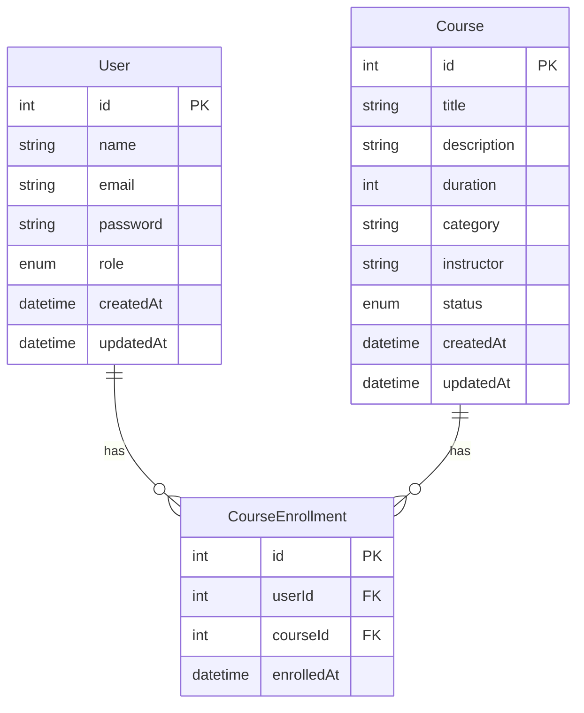

```mermaid
erDiagram
    User {
        int id PK
        string name
        string email
        string password
        enum role
        datetime createdAt
        datetime updatedAt
    }
    
    Course {
        int id PK
        string title
        string description
        int duration
        string category
        string instructor
        enum status
        datetime createdAt
        datetime updatedAt
    }
    
    CourseEnrollment {
        int id PK
        int userId FK
        int courseId FK
        datetime enrolledAt
    }
    
    User ||--o{ CourseEnrollment : "has"
    Course ||--o{ CourseEnrollment : "has"
```
