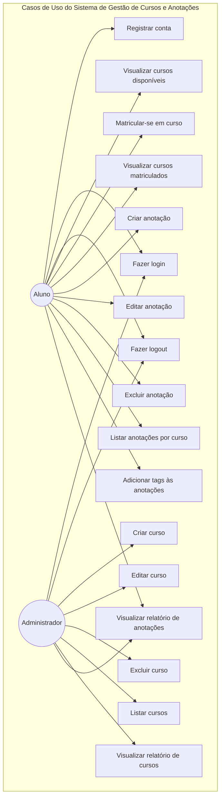

```mermaid
graph TD
    subgraph "Casos de Uso do Sistema de Gestão de Cursos e Anotações"
    
    %% Atores
    Student((Aluno))
    Admin((Administrador))
    
    %% Casos de uso - Autenticação
    UC1[Registrar conta]
    UC2[Fazer login]
    UC3[Fazer logout]
    
    %% Casos de uso - Administração de cursos
    UC4[Criar curso]
    UC5[Editar curso]
    UC6[Excluir curso]
    UC7[Listar cursos]
    
    %% Casos de uso - Alunos e cursos
    UC8[Visualizar cursos disponíveis]
    UC9[Matricular-se em curso]
    UC10[Visualizar cursos matriculados]
    
    %% Casos de uso - Anotações
    UC11[Criar anotação]
    UC12[Editar anotação]
    UC13[Excluir anotação]
    UC14[Listar anotações por curso]
    UC15[Adicionar tags às anotações]
    
    %% Casos de uso - Relatórios
    UC16[Visualizar relatório de cursos]
    UC17[Visualizar relatório de anotações]
    
    %% Relacionamentos - Autenticação
    Student --> UC1
    Student --> UC2
    Student --> UC3
    Admin --> UC2
    Admin --> UC3
    
    %% Relacionamentos - Administração de cursos
    Admin --> UC4
    Admin --> UC5
    Admin --> UC6
    Admin --> UC7
    
    %% Relacionamentos - Alunos e cursos
    Student --> UC8
    Student --> UC9
    Student --> UC10
    
    %% Relacionamentos - Anotações
    Student --> UC11
    Student --> UC12
    Student --> UC13
    Student --> UC14
    Student --> UC15
    
    %% Relacionamentos - Relatórios
    Admin --> UC16
    Admin --> UC17
    Student --> UC17
    
    end
```
